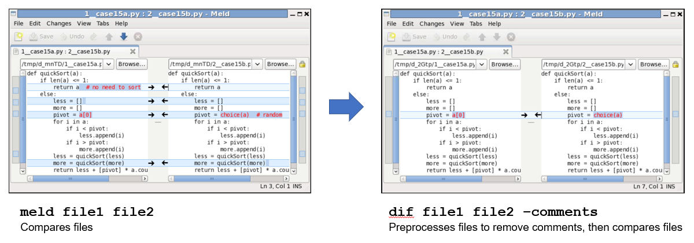
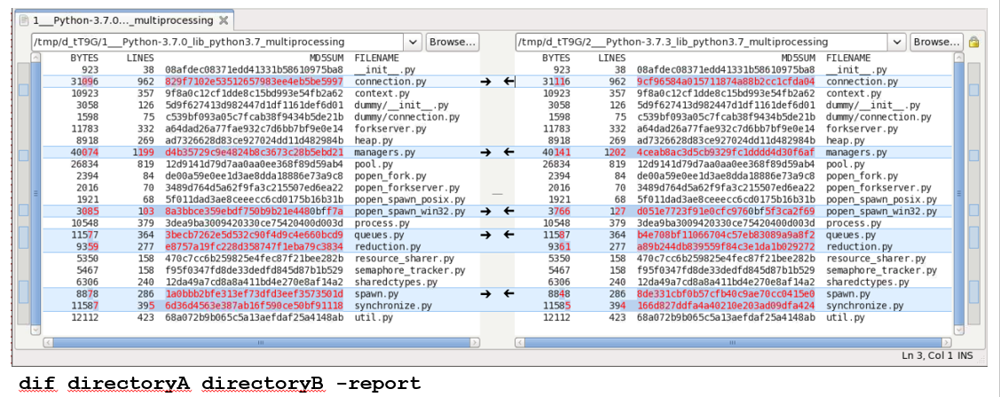

## dif - a preprocessing front end to meld / gvimdiff / kdiff3 / tkdiff / kompare

'dif' compares files after it preprocesses them.  
Preprocessing options include:
* remove comments, whitespace, timestamps
* search/replace
* keep/ignore certain lines
* json/yaml reformatting
* parse values from xls spreadsheets
* *many other options (see far below)*  
  
  

  
  
  
  
'dif' can also be used to compare directories recursively, after optionally preprocessing each file
  
  

  
  
  
  
## Overview
The graphical compare tools **meld**, **gvimdiff**, **kdiff3**, **tkdiff**, and **kompare** are used to compare text files on Linux

In many cases, it is difficult and time-consuming to visually compare large files because of the large number of differences

For example:
* different versions of code may differ only in comments or whitespace
* log files are often many MB of text, with some "don't care" information such as timestamps or temporary filenames
* json or yaml files may have ordering differences due to the library used to write the file
* xls spreadsheets cannot be compared easily because of the file format

## Purpose

'dif' preprocesses input text files with a wide variety of options

Afterwards, it runs the Linux tools meld, gvimdiff, kdiff3, tkdiff, or kompare on these intermediate files

This allows you to concentrate on the important differences, and ignore the rest

## Solutions

#### Problem: differences in whitespace or comments or case cause mismatches
Solution:  Use options -white or -nowhite or -comments or -case

#### Problem: files both need to be filtered using regexes, to strip out certain characters or sequences
Solution 1:  Use -grep <regex> or -ignore <regex> to filter in or out

Solution 2:  Use -search <regex> -replace <regex> to supply one instance of substitution and replacement

Solution 3:  Use -replaceTable <file> to supply a file with many substitution/replacement regexes
       
Solution 4:  Use -replaceDates to remove dates and timestamps
       
#### Problem: need to view your changes to a file on Perforce or SVN or GIT
Solution:  'dif file' will show the differences between the head revision and the local file

#### Problem: need to recursively compare directories
Solution 1:  'dif dir1 dir2' will iteratively compare pairs of files

Solution 2:  'dif dir1 dir2 -report' will open a GUI to compare the directories

Any preprocessing option (-comments, -white, -sort, -grep, etc) can be used when comparing directories

## Usage examples
* dif file1 file2
* dif file1 file2 -white -case
* dif file1 file2 file3 -comments
* dif file1 file2 -search 'foo' -replace 'bar'
* dif file1.xls file2.xls
* dif dir1 dir2 -report

## Options
       -comments          Remove any comments such as // or # or single-line */ /*.  Also removes trailing whitespace

       -white             Remove blank lines and leading/trailing whitespace
                          Condense multiple whitespace to a single space
       
       -noWhite           Remove all whitespace

       -case              Convert files to lowercase before comparing
       
       -grep 'regex'      Only display lines which match the user-specified Perl regex
                          Multiple regexs can be specified, for example:  -grep '(regexA|regexB)'
                          To display lines above/below matches, see the help text for option -externalPreprocessScript

       -ignore 'regex'    Ignore any lines which match the user-specified regex
                          This is the opposite of the -grep function

       -search 'regex'    On each line, do a global regex search and replace
       -replace 'regex'   
                          For example, to replace temporary filenames such as '/tmp/foo123456/bar.log' with '/tmp/file':
                              -search '/tmp/\S+' -replace '/tmp/file'
                              
                          Since the search/replace terms are interpreted as regex,
                          remember to escape any parentheses
                              Exception:  if you are using regex grouping, 
                                          do not escape the parentheses
                              For example:
                                  -search '(A|B|C)'  -replace 'D'

                          Since the replace term is run through 'eval', make sure to escape any $ dollar signs
                          Make sure to use 'single-quotes' instead of double-quotes
                          For example, to convert all spaces to newlines, use:
                              -search '\s+'  -replace '\n'

                          If case-insensitive search is needed, also use option -case

       -replaceTable file     Specify a two-column file which will be used for search/replace
                              The delimiter is any amount of spaces
                              Terms in the file are treated as regular expressions
                              The replace term is run through eval

       -replaceDates      Remove dates and times, for example:
                               17:36:34
                               Monday July 20 17:36:34 PDT 2020
                               Dec  3  2019
                               Jul 10 17:42
                               1970.01.01
                               1/1/1970

       -fields N          Compare only field(s) N
                          Multiple fields may be given, separated by commas (-fields N,M)
                          Field numbers start at 0
                          Fields in the input files are assumed to be separated by spaces,
                              unless the filename ends with .csv (separated by commas)
                          Example:  -fields 2
                          Example:  -fields 0,2      (fields 0 and 2)
                          Example:  -fields -1       (last field)
                          Example:  -fields 2+       (field 2 and above)
                          Example:  -fields not2+    (ignore fields 2 and above)
                          Example:  -fields not0,5+  (ignore fields 0, 5, and above)

       -fieldSeparator regex    Only needed if default field separators above are not sufficient
                                Example:  -fieldSeparator ':'
                                Example:  -fieldSeparator '[,=]' 

       -fieldJustify      Make all fields the same width, right-justified

       -split             Splits each line on whitespace
       
       -splitChar 'char'  Splits each line on 'char'
                          For example:  -splitChar ',' to split on comma
                          For example:  -splitChar ' \s+' to split on whitespace
                                                           each word will be on its own line

       -trim              Trims each line to 105 characters, discarding the overflow
                          Useful when lines are very long, and the important information is near the beginning
       
       -trimChars N       Trims with specified number of characters, instead of 105
       
       -head              Compare only the first 10000 lines
       
       -headLines N       Compare only the first N lines

       -tail              Compare only the first 10000 lines
       
       -tailLines N       Compare only the first N lines

       -yaml              Compare two yaml files, sorting the keys
       
       -json              Compare two json files, sorting the keys

       -removeDictKeys 'regex'
                          For use with -yaml or -json
                          Removes all dictionary keys matching the regex

       -basenames         Convert path/file to file
                          This can be useful when comparing log files which contain temporary directories
       
       -round 'string'    Round all numbers according to the sprintf string
                          For example -round '%0.2f'
       
       -dos2unix          Run all files through dos2unix

       -lsl               Useful when comparing previously captured output of 'ls -l'
                          Compares only names and file sizes

       -tartv             Compare tarfiles using tar -tv, and compare the names and file sizes
                          If file sizes are not desired in the comparison (names only), also use -fields 1
          
       -perlEval          The input file is a perl hashref
                          Print the keys in alphabetical order

       -perlDump          Useful when comparing previously captured output of Data::Dumper
                          filter out all SCALAR/HASH/ARRAY/REF/GLOB/CODE addresses from output of Dumpvalue,
                          since they change on every execution
                              'SPECS' => HASH(0x9880110)    becomes    'SPECS' => HASH()
                          Also works on Python object dumps:
                              <_sre.SRE_Pattern object at 0x216e600>

      
    Filtering options to target a section of the file:    

       -start 'regex'     Start comparing file when line matches 'regex'

                          If multiple lines matching regexes should be required to start capturing,
                          Separate the regexes with ^^
                          For example, to start capture after line matching 'abc' and then line matching 'def':
                          -start 'abc^^def'

                          By default, only the first occurrence of the start/stop sequence will be captured,
                          if multiple occurrences exist within the file

       -stop 'regex'      Stop comparing file when line matches regex
                          The last matching line will be captured, unless specified otherwise

       -startIgnoreFirstLine    This modifies the 'start' operation, so that
                                The first matching line will not be captured
       
       -stopIgnoreLastLine      This modifies the 'stop' operation, so that
                                The last matching line will not be captured
       
       -startMultiple     This modifies the 'start' operation, so that
                          multiple occurrences of the same start/stop sequence may be captured

       -start1 -stop1 -start2 -stop2
                          Similar to -start and -stop
                          The '1' and '2' refer the files
                          Enables comparing different sections within the same file,
                          or different sections within different files
                          
                          For example, to compare functions 'add' and 'subtract' within a single file:
                              dif a.pm -start1 'sub add' -stop1 '^}' -start2 'sub subtract' -stop '^}'

       -function 'function_name'
                          Compare same  Python def / Perl sub / TCL proc  function from two source files
                          Internally, this leverages the -start -stop functionality
                          This feature will also work for some C source files

       -functionSort
                          Useful when Python/Perl/TCL functions have been moved within a file
                          This option preprocesses each file, so that the function definitions
                          appear in alphabetical order
                          This feature will also work for some C source files

    Preprocessing options (before filtering):
       -externalPreprocessScript <script>          
                          Run each input file through your custom preprocessing script
                          It must take input from STDIN and send output to STDOUT, similar to unix 'sort'
                          
                          Trivial example:
                              -externalPreprocessScript 'sort'

                          Example using grep to show 2 lines above and below lines matching the regex 'foo'
                              -ext 'grep -C 2 foo'
                          
                          Examples for comparing binary files:
                              -ext '/usr/bin/xxd'
                              -ext '/usr/bin/xxd -c1 -p'
                              -ext '/usr/bin/hexdump -c'
                          However, a standalone diff tool may be preferable for comparing binary files
                          For example:
                              'qdiff' by Johannes Overmann and Tong Sun
                              'colorbindiff' by Jerome Lelasseux 
                              'VBinDiff' by Christopher J. Madsen
                              'dhex'
                         
       -bin               Compare binary files
                          This is a shortcut for running -ext '/usr/bin/xxd'

       -bcpp              Run each cpp input file through bcpp linting tool with options:  /home/ckoknat/cs2/linux/bcpp -s -bcl -tbcl -ylcnc

       -perltidy          Run each Perl input file through perltidy linting tool with options:  /home/utils/perl5/perlbrew/perls/5.26.2-060/bin/perltidy -l=110 -ce

    Postprocessing options (after filtering):
       -sort              Run Linux 'sort' on each input file

       -uniq              Run Linux 'uniq' on each input file to eliminate duplicated adjacent lines
                          Use with -sort to eliminate all duplicates
       
       -strings           Run equivalent of Linux 'strings' command on each input file to remove binary characters

       -fold              Run 'fold' on each input file with default of 105 characters per column
                          Useful for comparing long lines, so that scrolling right is not needed within the GUI

       -foldChars N       Run 'fold' on each input file with N characters per column

       -ppOnly            Stop after creating preprocessed files

    Viewing options:
       -quiet             Do not print to screen

       -verbose           Print names and file sizes of preprocessed temporary files, before comparing

       -gui cmd           Instead of using kompare to graphically compare the files, use a different tool
                          This supports any tool which has command line usage similar to gvimdiff
                          i.e. 'gvimdiff file1 file2'.
                          This has been tested on meld, gvimdiff, kdiff3, tkdiff, and kompare, and likely works
                          with diffmerge, diffuse, kdiff, wdiff, xxdiff, colordiff, beyond compare, etc
                          Examples:

                          -gui gvimdiff
                              Uses gvimdiff as a GUI
                          
                          -gui kdiff3
                              Uses kdiff3 as a GUI

                          -gui tkdiff
                              Uses tkdiff as a GUI

                          -gui kompare
                              Uses kompare as a GUI

                          -gui meld
                              Uses meld as a GUI
                              Note that meld does not display line numbers by default
                              Meld / Preferences / Editor / Display / Show line numbers
                              If the box is greyed out, install python-gtksourceview2

                          -gui none
                              This is useful when comparing from a script
                              in an automated process such as regression testing
                              After running dif, the return status will be:
                                  0 = files are equal
                                  1 = files are different
                                  dif a.yml b.yml -gui none -quiet ; echo $?
                           
                          -gui diff
                              Prints diff to stdout instead of to a GUI

                          -gui 'diff -C 1' | grep -v '^[*-]'
                              Use diff, with the options:
                                  one line of Context above and below the diff
                                  remove the line numbers of the diffs

       -diff              Shortcut for '-gui diff'

    Options to compare a large set of files:
       <dirA> <dirB>         If dif is run against two directories,
                             will open GUI for each pair of mismatching files
                             For example:
                                 dif dirA dirB
                             
                             Any of the preprocessing options may be used
      
      -report                When used with two directories  or  -dir2 <dir>  or  -gold
                             Instead of opening GUIs for each file pair,
                             generate report of mismatching or missing files
                             For example:
                                 dif dirA dirB -report
                             Any of the preprocessing options may be used

                             It can also be used to print a simple report of
                             file sizes, number of lines, and md5sums (not a comparison)
                             For example:
                                 dif * -report
                                     or
                                 dif */file -report

      -fast                  When used with -report, use file size to compare, instead of md5sum
                             This is much faster, but could miss cases where bits are flipped

      -includeFiles <regex>  
      -excludeFiles <regex>  Both options are for use with two directories  or  -dir2 <dir>  or  -gold
                             For example:
                                 dif -includeFiles '*log' dirA dirB
                             Will open GUI for each pair of mismatching files

                             When used with -dir2 or -gold,
                             finds files in the current directory matching the Perl regex
                             For example:
                                 dif -includeFiles '*log' -dir2 ../old

                             Any of the preprocessing options may be used

       -dir2 <dir>           For each input file specified, run 'dif'
                                 on the file in the current directory
                                 against the file in the specified directory
                             For example:
                                 cd to the directory containing the files
                                 dif file1 file2 file3 -dir ../old
                             will run:
                                 dif file1 ../old/file1
                                 dif file2 ../old/file2
                                 dif file3 ../old/file3
                             Any of the preprocessing options may be used

       -gold                 When used with one filename (file or file.extension),
                             assumes that 1st file will be (file.golden or file.golden.extension)
                             
                             For example:
                                 dif file1 -gold
                             will run:
                                 dif file1.golden file1.csv
                          
                             For example:
                                 dif file1.csv -gold
                             will run:
                                 dif file1.csv.golden file1.csv
                          
                             When used with multiple filenames
                             it runs dif multiple times, once for each of the pairs
                             This option is useful when doing regressions against golden files
                             
                             For example:
                                 dif file1 file2.csv -gold
                             will run:
                                 dif file1.golden file1
                                 dif file2.csv.golden file2.csv
                             
                             Any of the preprocessing options may be used
       
      -tree <dir1> <dir2>    Special case.  Run unix 'tree' on each of the directories.  Does not preprocess files
    
    Other options:
       -stdin             Parse input from stdin and send output to stdout
                          For example:
                              grep foo bar | dif -stdin <options> | script2 | script3

       -stdout            Cat all preprocessed files to stdout
                          In this use case, dif could be called on only one file
                          This allows dif to be part of a pipeline
                          For example:
                              dif file -stdout <options> | another_script
                          If -stdin is given, then -stdout is assumed

       -out <file>        Similar to -stdout, but send output to file
                          This can be useful if dif is used as a preprocessing engine
       
       -keeptmp           Default behavior is to remove the tmp directory containing preprocessed files
                          This option keeps it

    Other features:
        Automatically uncompresses files from these formats into intermediate files:
            .gz
            .bz2
            .xz
            .zip  (single files only)
        
        Compares values inside .xls|.xlsm|.xlsx files
            requires the Perl Spreadsheet::BasicRead, Spreadsheet::ParseExcel, and Spreadsheet::XLSX modules to be installed
        
        Compares values inside .ods OpenOffice spreadsheet files  
            requires the Perl Spreadsheet::Read and Spreadsheet::ParseODS module to be installed
        
        Attempts to compare text inside .pdf files
            requires the Perl CAM::PDF module to be installed
       

    Default compare tool:
        The default compare GUI is meld
        To change this, create the text file ~/.dif.defaults with one of these content lines:
            gui: gvimdiff
            gui: tkdiff
            gui: kdiff3
            gui: kompare
            gui: meld
            gui: tkdiff
        You may also want to change the default (uncompressed) file size limit, before gvimdiff takes over from kompare/meld
        The default is 2000000 bytes
            meldSizeLimit: 1000000

    For convenience, link to this code from ~/bin
        ln -s /path/dif ~/bin/dif

    

    Perforce or SVN version control support:
            Perforce uses '#' to signify version numbers.  dif borrows the same notation for SVN
    Perforce or SVN examples:
            dif file              compares head version with local version (shortcut)
            dif file#h            compares head version with local version (shortcut)
            dif file file#head    compares head version with local version
            dif file#head #-      compares head version with previous version (shortcut)
            dif file#7            compares version 7 with local version (shortcut)
            dif file#6 file#7     compares version 6 with version 7
            dif file#6 file#+     compares version 6 with version 7
            dif file#6 file#-     compares version 6 with version 5
            dif file#6..#9        compares version 6 with version 7, and then compares 7 with 8, then 8 with 9
    Git example:
            dif file              compares committed version to local version

## Installation

No installation is needed, just copy the 'dif' executable

To see usage:
* cd ..  (back into dif main directory)
* ./dif

To run dif:
* ./dif file1 file2 <options>
       
To run the tests (optional):
* download dif from GitHub and uncompress it
* cd dif/test
* ./dif.t

This will run dif on the example* unit tests
It should return with 'all tests passed'

Perl versions 5.6.1 through 5.30 have been tested

For convenience, copy the dif executable to your ~/bin directory, or create an alias:

    alias dif /path/dif/dif
